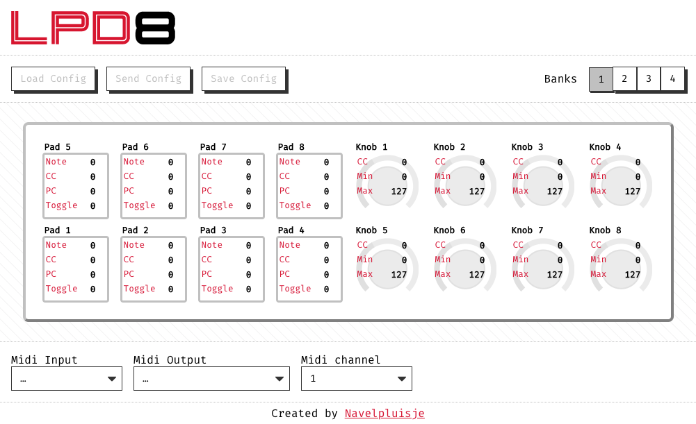

# LPD8 Editor

<link href="https://fonts.googleapis.com/css?family=Cookie" rel="stylesheet"><a class="bmc-button" target="_blank" href="https://www.buymeacoffee.com/navelpluisje">Buy me a beer</a>

## What is this?

This is a simple editor for the Akai LPD8 MIDI-controller.

## Why is it created?

Akai thinks money is more important then helping customers. Due to the lack of effort from their side to update their LPD8 Editor, I decided to build my own, web based. This way it will work in every browser on every OS, as long as web-MIDI is supported.

## What does it do?

* It can get data from the LPD8
* It can store the created config to the LPD8

## How does it work?

* Select an input device
* Select an output device, the active bank will get selected
* Click `Load Config` to get the bank data from the LPD8
* Make some changes
* Click `Send Config` to store the data to the LPD8

## What does not work (yet)?

* Store a config to a file
* Load a config from a file

## What helped me?

* https://github.com/charlesfleche/lpd8editor/blob/d3c312e226f55ab0082b66e4732f5b860dc7b5fb/doc/SYSEX.md
* https://github.com/mungewell/mpd-utils/blob/master/sysex/sysex_lpd8.md